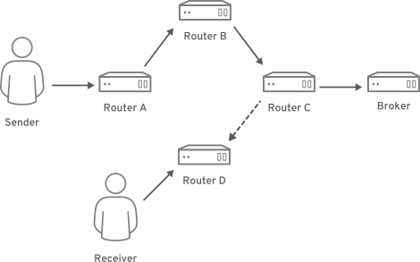

# Resilient Networking Demo
This demo is based on [section 10.2 of the A-MQ Interconnect User
Guide](https://access.redhat.com/documentation/en-us/red_hat_jboss_amq/7.0/html-single/using_amq_interconnect/#path_redundancy_and_temporal_decoupling)
titled "Path Redundancy and Temporal Decoupling".  This demo also requires the [Container Development Kit](https://developers.redhat.com/products/cdk/download/).  Download the latest release and then rename to `minishift`.

## Background
The Advanced Message Queuing Protocol (AMQP) 1.0 is a vendor-neutral,
wire-level [OASIS message standard](https://www.oasis-open.org/standards#amqpv1.0)
that enables multiple vendor products to seamlessly interoperate
without the need for complex bridges or adapters.

[AMQ Interconnect](https://access.redhat.com/documentation/en-us/red_hat_jboss_amq/7.0/html-single/using_amq_interconnect/)
leverages the AMQP standard to define application layer (ie. layer
7) lightweight message routers for building scalable, available,
and performant messaging networks.  Because the message routers are
at layer 7, they can provide simpler addressing schemes and a
messaging network independent of the potentially more complex layer
2 and 3 network.

AMQ Interconnect is based on Dispatch Router from the [Apache
Qpid](https://qpid.apache.org/index.html) project.  Refer to this
[article](https://netprototalk.wordpress.com/2015/10/01/amqp-as-a-network-protocol-2/)
for an excellent overiew of AMQP as a generalized networking protocol.

## Demo Scenario
As shown in the following diagram, a sender and a receiver connect
to an AMQ Interconnect messaging network.  The sender connects to
router A and the receiver connects to router D.  Initially, routers
A, B, and C are connected to each other, however router D is not
connected to the other routers in the network.  When the sender
attempts to send messages to the receiver, the messages transit
routers A through C where they are then stored in the broker attached
to router C.

  

Router C is then reconfigured to connect to router D, establishing
a path for the messages held in the broker attached to router C to
transit to router D where the messages are then delivered to the
receiver.

## Prerequisites
This demo leverages the Red Hat Container Development Kit (CDK) for
OpenShift Container Platform development.  You may have to adjust
these instructions to work with an alternative OpenShift environment.
Please start with the [CDK installation](https://developers.redhat.com/products/cdk/overview/) for
your platform before attempting these instructions.

OpenShift is not required to run AMQ Interconnect since interconnect
consists of lightweight processes running on top of RHEL.  However,
OpenShift simplifies running multiple routers for this demonstration
by placing them in lightweight containers with their own network
namespace.

## Create and Configure Minishift VM
Follow the instructions in this section when launching the CDK guest
for the first time or after doing a `minishift delete`.

### Start the CDK
To launch the CDK,

    minishift setup-cdk --force --default-vm-driver virtualbox
    minishift config set image-caching true
    minishift start --cpus 4 --disk-size 50g --memory 10240 \
        --username 'YOUR-RHSM-USERNAME' --password 'YOUR-RHSM-PASSWORD'

This assumes that you're using [VirtualBox](https://www.virtualbox.org/)
as your default virtual machine driver.  Adjust accordingly if
you're using a differenct VM driver and also adjust the amount of
virtual cpus, disk, and memory for what you have available.

Make sure to substitute your own Red Hat Subscription Manager (RHSM)
credentials.  You will need a subscription that includes the following
repositories:

* `amq-interconnect-1-for-rhel-7-server-rpms`
* `a-mq-clients-1-for-rhel-7-server-rpms`

NB: Those repositories are currently not included with RHSM login
credentials from the [Red Hat Developer Program](https://developers.redhat.com/).

### Configure RHSM Repositories
Dockerfile builds on OpenShift can allow containers to leverage the
repositories defined on the VM host executing the build.  Make sure
to enable the required repositories so they are available to the
docker build.  After starting the CDK guest, run the commands:

    minishift ssh
    sudo subscription-manager remove --all
    sudo subscription-manager attach --pool=YOUR_POOL_ID
    sudo subscription-manager repos --disable='*'
    sudo subscription-manager repos \
        --enable=rhel-7-server-rpms \
        --enable=amq-interconnect-1-for-rhel-7-server-rpms \
        --enable=a-mq-clients-1-for-rhel-7-server-rpms

Make sure that the pool identifier specified in `YOUR_POOL_ID`
provides access to the needed AMQ Interconnect repositories.

Validate that the repositories are correctly configured by confirming
that the qpid packages are available using:

    sudo yum -y search qpid
    exit

## Configure the OpenShift Command Line Interface
On the host where you ran `minishift`, type the following command
to enable the OpenShift command line interface:

    eval $(minishift oc-env)

## Create the Demo in OpenShift
### Configure the Demo Project
On the host where you launched `minishift`, login to OpenShift and
create the project:

    oc login 192.168.99.100:8443 -u developer -p developer
    oc new-project resilientnet

The router instances will require configuration files.  We'll use a
[ConfigMap](https://access.redhat.com/documentation/en-us/openshift_container_platform/3.6/html-single/developer_guide/#dev-guide-configmaps)
to provide the needed configuration to the router pods at runtime.
The ConfigMap object provides mechanisms to inject containers with
configuration data while keeping containers agnostic of OpenShift
Container Platform. A ConfigMap can be used to store fine-grained
information like individual properties or coarse-grained information
like entire configuration files or JSON blobs.

    git clone https://github.com/rlucente-se-jboss/resilient-network-demo.git
    cd resilient-network-demo
    oc create configmap network-config --from-file=resources/

### Create the ImageStream for the Router Instances
Create the application's imagestream using the commands:

    oc new-build . --name amq-interconnect --strategy docker
    oc logs bc/amq-interconnect --follow

Wait until the build completes and the image is pushed to the
registry.

### Create the Broker and Router Instances
Create the router instances and a broker via a template.  This
template relies on the ConfigMap and ImageStream created above.

    oc process -f resilient-network-template.yaml | oc create -f -

Wait until the router pods and the broker pod are running.
You can see them using:

    oc get pods

## Run the Demo Scenario
The python qpid client is installed in the amq-interconnect image.
The demo scenario will use three command line terminal windows.
The current terminal window on the host is hereafter referred to
as the HOST.  The second and third windows, hereafter referred to
as SENDER and RECEIVER, are where the python qpid client are run.

Open a terminal window for SENDER and type:

    eval $(minishift oc-env)
    oc run -i -t --rm=true sender \
        --image=172.30.1.1:5000/resilientnet/amq-interconnect \
        --restart=Never --command -- /bin/bash

In the SENDER, send messages to the intended recipient:

    cd /usr/share/qpid-proton/examples/python/
    python simple_send.py \
        -a router-a.resilientnet.svc.cluster.local:6000/101st_Airborne_Division/506th_Parachute_Infantry_Regiment/HQ \
        -m 5

Note that we're using an AMQP address of
`101st_Airborne_Division/506th_Parachute_Infantry_Regiment/HQ`.
The configuration file for the AMQ Interconnect routers will forward
all messages with the address prefix `101st_Airborne_Division`.
The waypoint setting on the address ensures that messages will be
pushed onto a queue so that the sender and recipient do not need
to be on the network simultaneously.  The addresses used by the
routers are highly flexible and do not require complex configuration
of DNS servers for resolution.

In the SENDER, you will see 'all messages confirmed' since the
broker is storing the messages.

Open a terminal window for RECEIVER and type:

    eval $(minishift oc-env)
    oc run -i -t --rm=true receiver \
        --image=172.30.1.1:5000/resilientnet/amq-interconnect \
        --restart=Never --command -- /bin/bash

In the RECEIVER, attempt to receive the messages using:

    cd /usr/share/qpid-proton/examples/python/
    python simple_recv.py \
        -a router-d.resilientnet.svc.cluster.local:6000/101st_Airborne_Division/506th_Parachute_Infantry_Regiment/HQ \
        -m 5

This will block since the RECEIVER does not have a path to actually
receive the messages from the broker.

In the HOST, change the QDROUTER_CONF environment variable for
router-c which will cause it to redeploy with a connection to both
the broker and router-d.

    oc set env dc/router-c QDROUTER_CONF=/etc/qpid-dispatch/router-c-mod.conf

Once router-c is redeployed and the network is stable, you will see
the messages delivered in the RECEIVER:

    {u'sequence': int32(1)}
    {u'sequence': int32(2)}
    {u'sequence': int32(3)}
    {u'sequence': int32(4)}
    {u'sequence': int32(5)}

The takeaway is that the messages were held in the broker until a
delivery path to the recipient was available.

## Using Management Tools
You can easily use the qdstat and qdmanage command-line tools by
specifying the router within the CLIENT.  Use the command line tools
via:

    qdstat -b router-a.resilientnet.svc.cluster.local:6000 -va
    qdstat -b router-b.resilientnet.svc.cluster.local:6000 -va
    qdstat -b router-c.resilientnet.svc.cluster.local:6000 -va

which gets a list of the configured addresses.

## Using the Hawtio Console
The hawtio web console can be used to graphically view the
amq-interconnect router network.  First, download [AMQ
7](https://developers.redhat.com/products/amq/download/).

In a separate terminal window, install and run AMQ 7 on the host:

    unzip -q /path/to/amq-broker-7.0.2-bin.zip
    amq-broker-7.0.2/bin/artemis create --allow-anonymous --user admin \
        --password 'admin1jboss!' mybroker
    mybroker/bin/artemis run

Browse to the hawtio console on the host at
[http://localhost:8161/hawtio](http://localhost:8161/hawtio) and
then login using the credentials above.

When the console appears, click on the `Dispatch Router` link and
then enter the address and port for `Router.A` as:

| Parameter | Value |
| --------- | ----- |
| Address | router-a.resilientnet.svc.cluster.local |
| Port | 80 |
| Autostart | Checked |

Then press the `Connect` button.  The resulting page offers an
overview of the network, viewing and changing specific entities,
and viewing the topology graphically.

